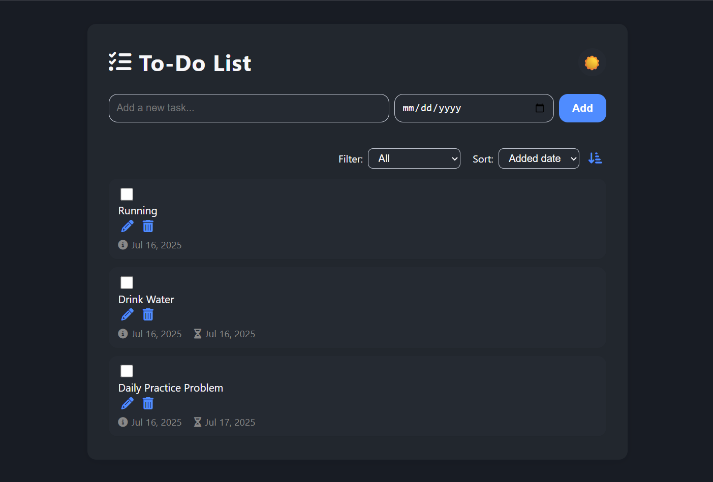

# Modern Responsive To-Do List App

A fully responsive, modern, and easy-to-use web-based To-Do List application built with HTML, CSS, and JavaScript.

---

## ✨ Features

- **Add, edit, delete, and complete tasks**
- **Set due dates** for each task
- **Filter tasks:** All, Completed, Active, Has Due Date
- **Sort tasks:** By added date or due date (ascending/descending)
- **Created date** and **due date** display for every task
- **Dark/Light mode toggle** (your preference is remembered)
- **Persistent data:** Tasks are saved in your browser (localStorage)
- **Responsive design:** Looks great on phones, tablets, and desktops
- **Modern UI:** Clean look, icons, large touch targets, easy navigation

---

## **Start Using!**

   - Add tasks with or without due dates.
   - Mark them as complete, edit, or delete as needed.
   - Use filter and sort options for easy task management.
   - Switch between Light and Dark mode with the toggle in the header.
   - Your tasks are always saved in your browser, even after refresh or restart.

